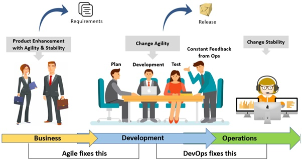

# Docker in DevOps

<p float="left">
  
  
  
  
</p>

----

## Introduction

A container is a way to package applications with all the necessary dependencies and configurations. When dependencies, binaries and configurations are packaged together, they become an **artifact** which in many cases is version controlled with **git** or **subversion** and is stored in a repository. GitHub, Subversion, GitLab, Bit bucket, Docker Hub, AWS ECR, etc are some of the remote public repositories.

To build the **artifact**, a build tool like **Maven, Gradle, npm, pip, yarn, AWS CodeBuild, Jenkins, Ansible, Bamboo, Puppet etc**, is needed to automate the creation of executable applications from source code.

After an artifact is build, it's published into an artifactory or repository, where it can be downloaded by executing a **curl** or **wget** and store it elsewhere.

## Docker, Containers and Virtual Machines

Docker is a **Platform As A Service (PAAS)** software framework used for building, running and managing containers in both local servers and the cloud.

Containerization entails placing a software component and its environment, dependencies, and configuration, into an isolated unit called a container. This makes it possible to deploy an application consistently on any computing environment, whether on-premises or cloud-based.

The cool thing with Docker is that it works on the host kernel itself without any possibility to create multiple instances of operating systems (OS) even though Docker itself runs on Linux whilst Hypervisors (bare-metal and type-2) are OS agnostic.

Virtual Machines (VM) differ with Docker as they are created with hypervisors and each need it's own OS securely isolated from each other which is resource intensive.

* No need to build and move different artifact types (e.g Jr, War, Zip)

* No need for a repository for each file type
  
* No need to install dependencies on the servers

* Docker Image is an artifact, so no need to get a build tool

## DevOps Process

DevOps is a philosophy that combines practices and tools increasing an organisations ability to deliver services and applications at a fast pace. In traditional software development cycle, we had the siloed approach where business management, development and operations worked on their own. Business would pass their requirements to the development team who would build the application. When it was ready for release, it would be sent to operations team who would build the infrastructure and deploy.



In such a scenario there  would arise conflicts stemming from communication, test frameworks, versions, scripts, monitoring tools, etc. In many cases waterfall methodology was used (Requirements, Development, Testing, Operations).

To solve this DevOps was born which is a way of breaking silos and working between Dev's and Op's. In DevOps, there is a common language to communicate and often agile methodologies like  SCRUM are used in the development life-cycle.
The main tasks of DevOps today are;

* BUILD

* TEST

* PUSH

* DEPLOY

These tasks enhance speed of development, testing, scaling, improved collaboration, security, reliability and the whole development cycle because they are integrated with **Continuous Integration** and  **Continuous Development**

It’s the DevOps Engineers role to automate the build process of the application using the CI/CD Pipeline, install dependencies, run tests, build/bundle the application and push to a repository.


## Introducing Docker

In this project, I will go through local development with Docker containers and later on publish to a private Docker Repository in AWS Elastic Container Registry (ECR). [Amazon ECR](https://docs.aws.amazon.com/AmazonECR/latest/userguide/ecr-ug.pdf) is a fully managed Docker container registry that makes it easy for developers to store, manage, and deploy Docker container images.

Docker application images are stored in [dockerhub](https://hub.docker.com/). All official images are stored there. In dockerhub, anyone can sign up and store images which can be either private or public. For instance, in my [dockerhub](https://hub.docker.com/u/appwebtech) account, there are images which I have made public which may have some minor modifications from the base images.

## Basic Docker Commands

Docker installation is dependent on the OS you are running and docker desktop is ideal for Macs and Windows. It comes with Docker Engine, Docker CLI client, Docker Content Trust, Docker Compose, Kubernetes and Credential Helper. After installing and running Docker Desktop, it will run in the background and there will be no need to initialise the docker daemon like in Linux.

```shell
docker –version  # current docker version in your machine
docker pull httpd:2.4-alpine  # fetches Apache HTTP server in docker hub
docker push # Push an image to docker hub or to some other private repo
docker images # Display images in your machine
docker run httpd:2.4-alpine # runs the dowloaded image as a container in your machine
docker container ls # Displays all running containers
docker container ls -a # Displays all containers whether running or not
docker ps # Dsiplays running containers
docker ps -a # All running and closed containers
docker exec # Used to access a running container
docker stop # Stops a container
docker kill # Immediately stops a containers execution without gracefully shutting it down
docker login # Loging to the docker hub repo
docker rm # Delete a stopped container
docker rmi # Delete an image from local storage
docker build # Build an image from a specified docker file
docker network < + a prompt> # Create / Connect / Disconnect / Display / Remove a container from a network
```


</hr>


To inspect a container, you use **docker inspect** command. The commamnd will give a lot of information, but you can filter out by grepping or passing specific info using --format argument.
It's also possible to view logs by running the **docker container logs <containerID>** and also rename the container.


## Containerizing an Nginx Server Using Docker

I will pull an nginx Image from my repository in docker hub and run it locally. I will map port 8080 to port 80 of the container.

```shell
docker container run -itd -p 8080:80 appwebtech/nginx
```


## Exporting and Importing a Container

The container **a1ea740bc6be** which houses **Ubuntu:14.04** has been modified by installing git, tree and cmatrix (a cool screensaver). I will export this container and rename it **ubuntu-git-tree-cmatrix.tar**. Subsequently I'll import it again assigning it a different image ID, run it in a different container and verify my installations.


</hr>


## Docker Volumes

Docker containers data is ephemeral. If we add files in a folder like /temp and we delete the container, that data will also be deleted. If we are working in prod, then crucial data might be lost.

To persist data in docker we use docker volumes or bind mounts. I will pull a **mysql** image and poke things around. The volume will be mounted in */var/lib/mysql* path, which can be viewed if **docker image inspect mysql** command is run.


For some reason, Mac OS doesn't have the same file path as in Linux. So I had to do a work around of installing a debian image to trick the kernel in abstracting a path */var/lib/docker/volumes/* which mimics a Linux environment.


I will now jump inside the container and create a few mysql databases and then remove the container. What I want to demonstrate is data persistence. If I check the schema in the container, we only have 4 rows like before.


</hr>


If I check the volumes, we do have 2 volumes, and I need to create a container with the volume id **13e0ad9effd318b609f008ccfc694c8d23b1b9a99e0adf186defe6341bf6ef7d** as thats where the database was modified with 3 extra tables making a total of 7.

I have created another container with volume **13e0ad9effd318b609f008ccfc694c8d23b1b9a99e0adf186defe6341bf6ef7d**, which will have a container ID of **c60ba4562f20e3e1e0bcbaf40c1a2261fd8ca0df6b9d4442320bdb73457150c6**. I will run it and verify that the saved data persisted.


## Developing with Docker

To kick the wheels, I'll now start using Docker in a local development environment. For the frontend, I'll use Bootstrap with JS and for the backend I'll use NodeJS. In order to persist data from the UI, I'll use a Docker container of MongoDB for storage and MongoExpress UI which is a lightweight web-based administrative UI to enable me interact with the data in Mongo Database (DB).

I'll now go ahead and pull [Mongo](https://hub.docker.com/_/mongo) and [Mongo-express](https://hub.docker.com/_/mongo-express) to my local machine. Next thing to do is run the two images in order to make them available for our application.

### Docker Networking

Docker containers need a networking layer in order to relay information with each other, with remote hosts as well as with the host machine. By default, a bridge network is created upon Docker installation.
As you can see below, no containers are assigned to it as there are no containers present.


Whenever we create a container, the bridge network gets created which enables packets flow from the main network interface (eth0) of the host machine to the network interfaces of each container. In our scenario, we have our isolated Docker network with NodeJS communicating with MongoDb and we'll use Mongo-express to view data and create collections in our mongo DB. The client browser is running outside the Docker network will connect to our application using the port assigned to it.

I'll create a network **mongo-network** which I'll provide when instantiating the mongo container. When running the MongoDB instance container, I will map the container port with the host and add environmental variables. I'll also poke the mongo-network just to ascertain that the container ID is mapped with the mongo-network.


I also ran mongo-express and the server-UI Is up and ready. But there is an easier way to configure all this. Next, introducing Docker compose.


</hr>


### Docker Compose

Previously I pulled MongoDB and Mongo-express base images from docker hub, ran them as docker containers and connected them to an basic NodeJS app. Those commands which we ran in terminal can be cumbersome especially if you are deploying many containers. It's a tedious process prone to error unless you are automating the whole process with a tool like Ansible (more about it in a future demo). That's why docker compose comes in handy.

Below are the two commands which I ran previously to instantiate mongoDB and mongo-express.

```shell
# Mongo
docker run -p 27017:27017 -d \
-e MONGO_INITDB_ROOT_USERNAME=admin \
-e MONGO_INITDB_ROOT_PASSWORD=password \
--name mongodb \
--net mongo-network \
mongo

# Mongo Express
docker run -d \
-p 8081:8081 \
-e ME_CONFIG_MONGODB_ADMINUSERNAME=admin \
-e ME_CONFIG_MONGODB_ADMINPASSWORD=password \
--net mongo-network \
--name mongo-express \
-e ME_CONFIG_MONGODB_SERVE=mongodb \
mongo-express
```

I will be mapping the commands in a yaml file called **docker compose**, which will aid in running the containers automatically. It's a file which is used to run ad-hoc docker commands.

```yaml
version: '3'
services:
  mongodb:
    image: mongo
    ports:
      - 27017:27017
    environment:
      - MONGO_INITDB_ROOT_USERNAME=admin
      - MONGO_INITDB_ROOT_PASSWORD=password
  mongo-express:
    image: mongo-express
    ports:
      - 8080:8081
    environment:
      - ME_CONFIG_MONGODB_ADMINUSERNAME=admin
      - ME_CONFIG_MONGODB_ADMINPASSWORD=password
      - ME_CONFIG_MONGODB_SERVER=mongodb
```

I terminated the previous containers and ran the docker compose command to start the contianers. The server will spit out a lot of mumbo jumbo that I wont post here but hey, who cares so long us I get the job done.


</hr>


</hr>


</hr>

I have created a users collection of a fake company named *Zebra Inc* and ran the NodeJS app on localhost port 3000. If I save data from the browser UI, it should persist in the MongoDB as you can see in the following images. Unfortunately, if I stop the containers, I will lose the data and have to recreate it.


</hr>


If I modify the data in the UI, it should be saved in the DB. See saved data below.
 


</hr>


</hr>

To stop the containers, I don't need to stop them individually like before. I can issue the command below and all the containers associated with the app will be stopped.

```shell
docker-compose -f mongo.yaml down
```


At this juncture, the application is ready. It's tested, no bugs but it has to be deployed. So packaging it up into a docker build should be the next step.

## Building a Docker Image From Scratch

To deploy the app, we have to package it into a docker image and prepare it to be deployed into some environment. Normally, after commiting in Git, a [Continuous Integration (CI)](https://www.devonblog.com/continuous-delivery/continuous-integration-best-practices/) is run to build the aplication, possibly with a tool like Jenkins which would have build tools like Maven, Gradle, etc depending on the type of code. Jenkins for instance would package the app into a docker image and then it pushes it into a Docker repo like Docker Hub. I won't be using Jenkins anyway because I have it installed in an EC2 instance in AWS, but I'll simulate that locally. I will be using Dockerfile. I won't deconstruct all the components of a Dockerfile but they are well articulated by the [Dockerfile](https://docs.docker.com/engine/reference/builder/) documentation.

```Dockerfile
FROM node:13-alpine

ENV MONGO_DB_USERNAME=admin \
    MONGO_DB_PWD=password

RUN mkdir -p /home/app

COPY ./app /home/app

WORKDIR /home/app

RUN npm install

CMD ["node", "server.js"]
```

I have build my Dockerfile and committed it in Git and now it's ready for deployment.


With the image created, I can run it with docker and it will listen at port 3000.


Lets now get inside the image of the app we created and poke things around.


## Amazon Elastic Container Registry (ECR)

Amazon Elastic Container Registry (ECR) is a fully managed container registry that makes it easy to store, manage, share, and deploy your container images and artifacts anywhere. There are other options like [Nexus](https://www.sonatype.com/products/repository-pro?) and [DigitalOcean](https://www.digitalocean.com/) but today I will use ECR. I will log in the AWS platform and navigate to ECR.

In ECR, there are two options. You can choose to make your repository private or public, just like in DockerHub. I'll make mine private, then I'll choose create. One thing with AWS is that they have tonnes of documentation for their services and whenever you are in doubt, just consult them. I've had people ask me, "Joseph, how can I achieve such and such a task with such and such a service?" In some occasions I actually don't know the answer, so I read the documentations and the pointers are always there.


Now that we have created a repository, I need to push the image my-app image to my-app repo which I have created in AWS ECR.


I will authenticate locally so that my local environment is authenticated with my AWS account, then push the image. Ne need to build it as it was already built. After a successful push, you can see the hash in ECR corresponds with the one locally. Incase we add a feature in our project, we can still build the project again and tag it with the latest version. What I have done locally is what a Jenkins server would do.


## Deployment

I will be deploying the application that I build in a docker image from AWS ECR to a development server or production. I will be deploying it with Docker compose. I have modified the Docker compose code to add the ECR endpoint, which will enable me to pull the image and deploy it in whatever server I want.

```yaml
version: '3'
services:
 my-app:
    image: <AWS-credentials>.dkr.ecr.eu-west-1.amazonaws.com/my-app:1.0/my-app:1.0
    ports:
     - 3000:3000
  mongodb:
    image: mongo
    ports:
      - 27017:27017
    environment:
      - MONGO_INITDB_ROOT_USERNAME=admin
      - MONGO_INITDB_ROOT_PASSWORD=password
  mongo-express:
    image: mongo-express
    ports:
      - 8080:8081
    environment:
      - ME_CONFIG_MONGODB_ADMINUSERNAME=admin
      - ME_CONFIG_MONGODB_ADMINPASSWORD=password
      - ME_CONFIG_MONGODB_SERVER=mongodb
    restart: unless-stopped
```

Containers are trending a lot and they are shaping the future of software development and cloud technologies. We are seeing many companies adopting Docker and the rise of apps deployed in Docker containers is exponentially rising. Cloud technologies to accommodate the tech are evolving like the Amazon Elastic Container Service ECS which is a fully managed container orchestration service that helps you easily deploy, manage, and scale containerized applications.

When I get some time I'll deploy the app in an Amazon ECS Fargate cluster which is a serverless service. This means that it takes care of capacity provisioning, load balancing and application health monitoring in the cloud.

## Persisting Data

Previously I introduced Docker Volumes and what I said about data persistence still persists. Nothing has changed. Yes, tech stacks can evolve and change very first but it's usually for the better.

To add volumes in our image, we use [Docker Named Volumes](https://docs.docker.com/storage/volumes/). Usually the path is added in the yaml file in the following manner. Then you add all the other images you need, eg redis, jenkins, postgres, etc then you define under which path the volumes will be mounted.

```yaml
version: '3'
services:
 my-app:
    image: mongo
    ports:
     - 27017:27017
  volumes:
  - db-data:/var/lib/mysql/data
```

I will run the image locally and recreate the database (my-db) with a collection of users, then add a new user. 


</hr>


If I were to restart the container, I would lose the data. So I'll add the named volumes for MongoDB as mongo-data *mongo-data:/data/db*. Mongo-express is a UI interface that fetches data from MongoDB to enable us to visualise the actual data on browser without storing it. My docker-compose yaml file will now look like this;

```yaml
version: '3'
services:
 my-app:
    image: <AWS-credentials>.dkr.ecr.eu-west-1.amazonaws.com/my-app:1.0/my-app:1.0
    ports:
     - 3000:3000
  mongodb:
    image: mongo
    ports:
      - 27017:27017
    environment:
      - MONGO_INITDB_ROOT_USERNAME=admin
      - MONGO_INITDB_ROOT_PASSWORD=password
    volumes:
      - mongo-data:/data/db
  mongo-express:
    image: mongo-express
    ports:
      - 8080:8081
    environment:
      - ME_CONFIG_MONGODB_ADMINUSERNAME=admin
      - ME_CONFIG_MONGODB_ADMINPASSWORD=password
      - ME_CONFIG_MONGODB_SERVER=mongodb
    restart: unless-stopped
volumes:
  mongo-data:
    driver: local
```

The path */data/db* inside our mongoDB contains data that the container uses and it will be persisted in the named volume when the container restarts.


I have demonstrated how containers work at a high level with Docker technology. Managing many containers which need to be deployed in multiple servers in a distributed way can have a lot of overhead. There are container orchestration tools like Kubernates which aid in automating this tasks.
